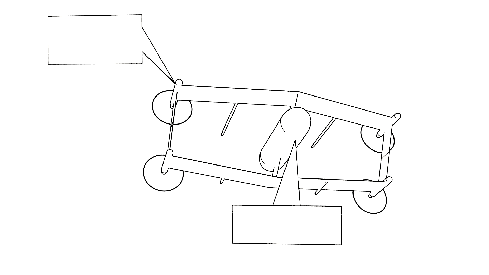

[[DMC-DEMO-000-00-01-01A-00KA-A]]

|===
|**DOCUMENTATION SYSTEM INFORMATION**
|===

// tag::revnumber[]
[.revnumber]
*Revision Number*: {revnumber}
// end::revnumber[]

*Processor Backend*: {backend}

*Publication Module Path*: {docdir}

|===
|**CONTACT**
|===

// tag::contact[]
[.contact]
John Mogilewsky +
1180 39th St +
Washougal WA 98671 +
Phone: 941.322.7197
// end::contact[]

|===
|**DATA RESTRICTIONS**
|===

// tag::export[]
[.export]
*EAR* - This document contains no ITAR-controlled data.
// end::export[]

// tag::proprietary[]
[.proprietary]
*PROPRIETARY* - This document contains proprietary information to {firstname} {lastname}.
// end::proprietary[]

// tag::uspatent[]
[.uspatent]
*U.S. PATENTS* - Ascii1000D is patent pending {firstname} {lastname}
// end::uspatent[]

// tag::proprietary_short[]
[.proprietary_short]
(C) PROPRIETARY by SPECAGILE
// end::proprietary_short[]

// tag::export_short[]
[.export_short]
*EAR* - EAR uncontrolled data
// end::export_short[]

// tag::cover_logo[]
[.cover_logo]

// end::cover_logo[]