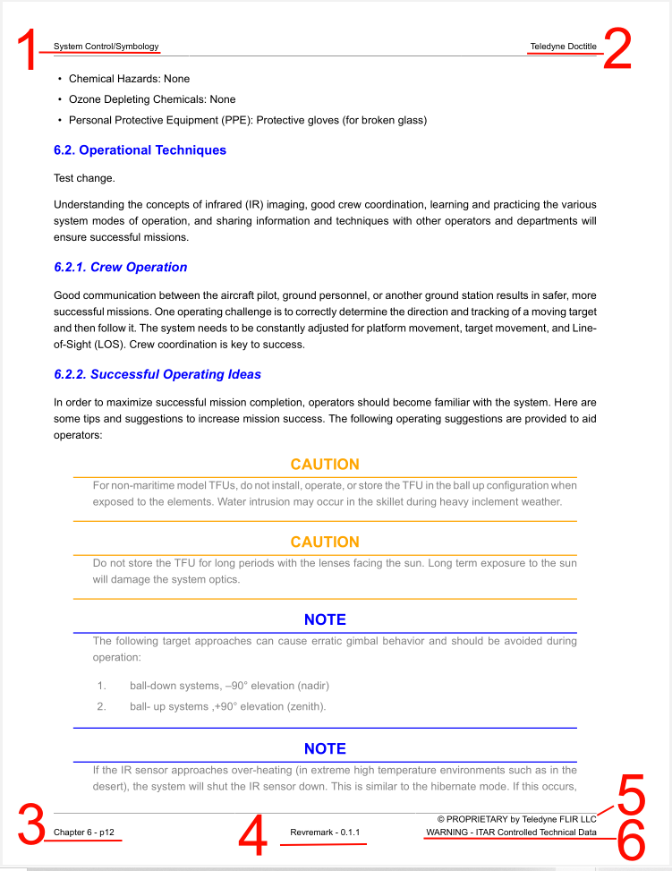
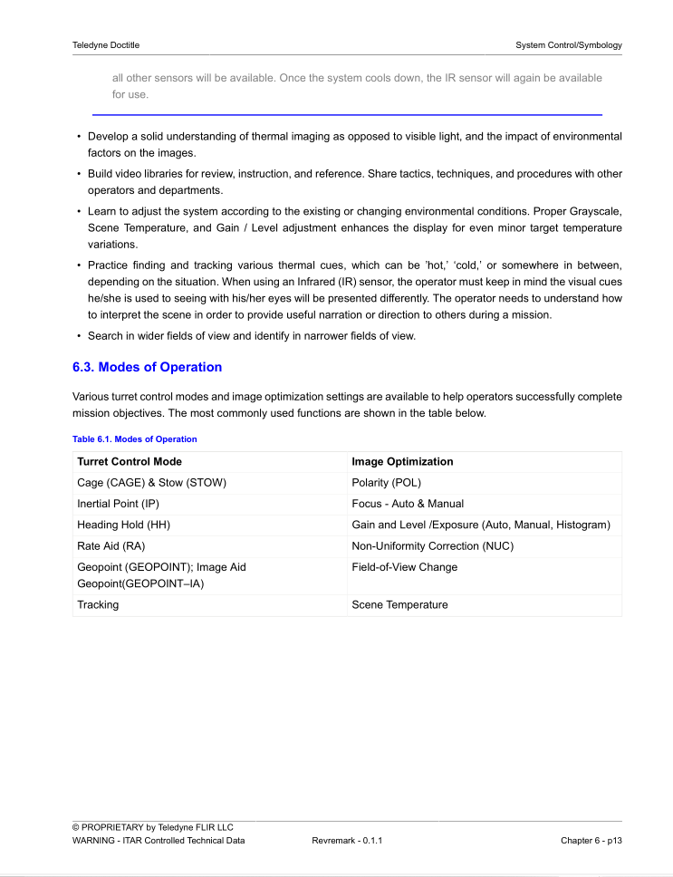

[[DMC-DEMO-000-40-01-01A-040B-A]]
= Teledyne Asciidoc: DocBook-XSL
Teledyne Techpubs <teledynetechpubs@teledyne.com>
v0.0.1, {docdatetime}: Revremark
:doctype: book
:encoding: utf-8
:lang: en
:toc: left
:toclevels: 4
:experimental:
:title-page-background-image: image:../GFX/_TeledyneFLIR.png[]
:numbering:
:sectnums:
:sectnumlevels: 5
:stylesheet: ../css/document.css,../css/cover.css
//../css/features/title-document-numbering.css
//../css/features/title-page.css
:docpnr: 999-999999-999
//:docinfo: shared
:title-logo-image: ../GFX/_TeledyneFLIR.png[]
:chapter-signifier: Chapter
//Applicability Attributes

include::../CIR/DMC-DEMO-000-00-00-01A-998Z-A.adoc[]

include::../CIR/DMC-DEMO-000-00-00-01A-999Z-A.adoc[]

include::../CIR/DMC-DEMO-000-00-00-01A-020A-A.adoc[]

== General

NOTE: "Autogen" refers to content created or referenced by the DocBook-XSL stylesheets

== Page Examples

.Cover Page Template (title recto)

.Legend for Cover Page Template
. Asciidoc PM (map) `doctitle`
. Asciidoc PM (map) `subtitle`
. Asciidoc PM (map) `revnumber`
. Asciidoc PM (map) `revdate`
. Asciidoc PM (map) `revremark`
. CIR element from `DMC-DEMO-000-00-00-01A-998Z-A.adoc` with role `contact`
. Cover logo set in DocBook-XSL `fo-pdf.xsl`
. CIR element from `DMC-DEMO-000-00-00-01A-998Z-A.adoc` with role `export`
. CIR element from `DMC-DEMO-000-00-00-01A-998Z-A.adoc` with role `proprietary`
. CIR element from `DMC-DEMO-000-00-00-01A-998Z-A.adoc` with role `uspatent`

.Book title verso

.Front Matter: ToC (autogen)

.Front Matter: LoF (autogen)

.Front Matter: LoT (autogen)

.Intentionally Blank Page (autogen)

.Chapter title page (always recto side)

.Content page, left side (verso)

.Legend for Content, Verso
. Asciidoc DM (module/topic) chapter title
. Asciidoc PM (map) `doctitle`
. Chapter number - Page number autogen
. Asciidoc PM (map) `revremark` + `revnumber`
. CIR element from `DMC-DEMO-000-00-00-01A-998Z-A.adoc` with role `proprietary_short`
. CIR element from `DMC-DEMO-000-00-00-01A-998Z-A.adoc` with role `export_short`

.Content page, right side (recto)

.Index (autogen)

.Glossary (gentext label "Terminology")

