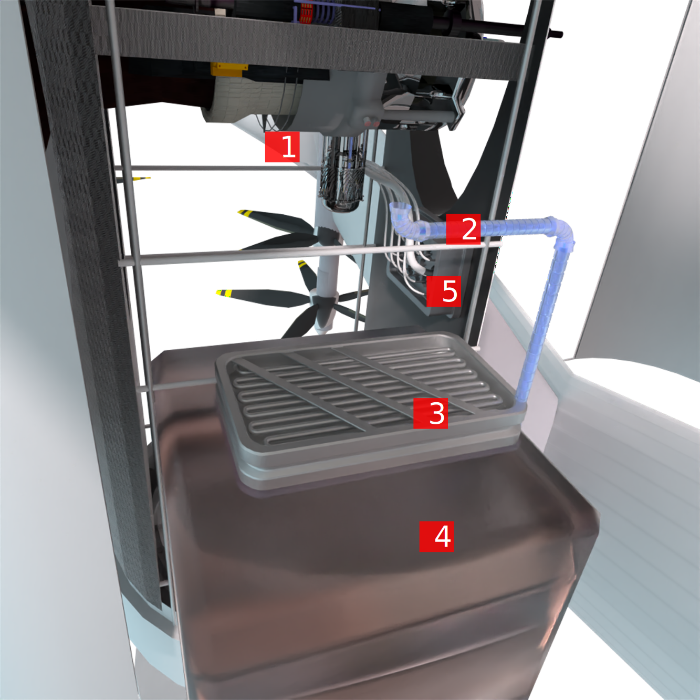

[[DMC-RSME-E28-10-01-01A-280A-A]]
= Fuel cell - Inspection

[abstract]
DMC-RSME-E28-10-01-01A-280A-A

== Prerequisites

=== Support equipment

NA

=== Supplies

NA

=== Spares

NA

== Procedure

.Components
. PMU fuel system intake module
. Fuel line
. Fuel filter
. Fuel tank
. PMU system built-in test

include::../CIR/DMC-DEMO-000-00-00-01A-0A4A-A.adoc[tag=Flammable]

[.procedure]
. Ensure electrical safety procedures are followed.
. Prepare shop towels for procedure.
. Visually inspect fuel filter module for external signs of leaks or damage.
. Visually inspect fuel module for external signs of leaks or damage.
. Visually inspect fuel line for external signs of leaks or damage
ifdef::CONFIG1[]
. If the system is CONFIG1, check yellow warning light
endif::CONFIG1[]
. Confirm green light on fuel system self-test.

== Closing Requirements

Ensure assemblies and surfaces do not have excess fuel

