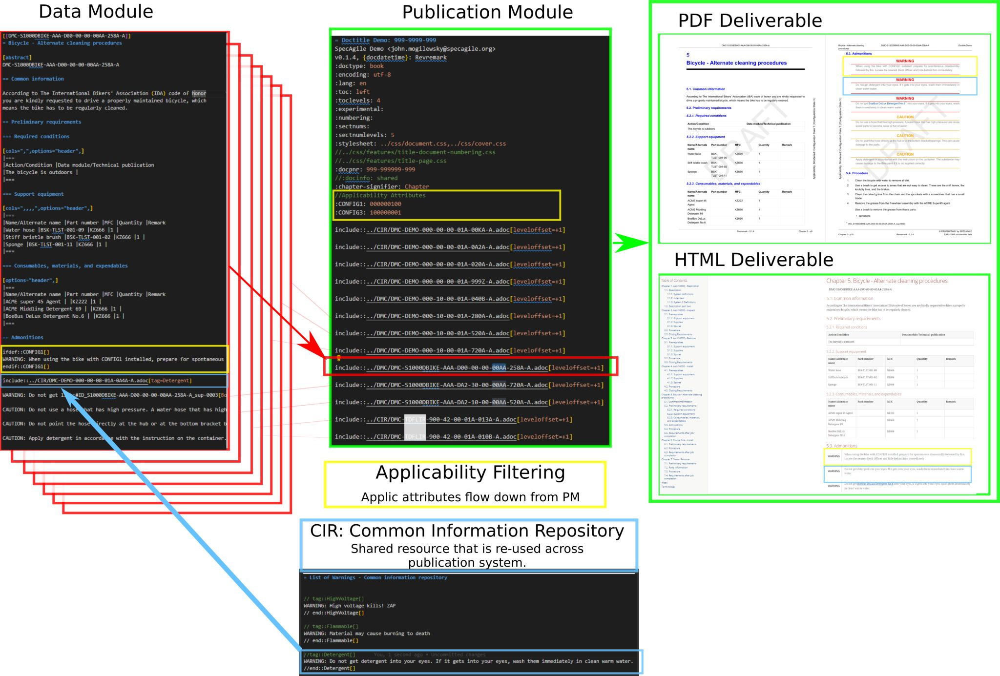

= Ascii1000D Demonstration
Lopsotronic Publications
v0.0.7, {docdate} 

[abstract]
DMC-ASDEMO-AAAA-000-00-00-01A-000B-A

.Simple Example of Ascii1000D CCSfootnote:[Component Content System] Functionality

== Premise

The S1000D specification combines three separate specifications:

. *Business Architecture Specification* includes elements like DMC components (MODELIC, SDC, MICC, SNS, etc), Applicability, CIRs and other constructs supporting defense and aerospace technical data.
. *Semantic Specification* relates elements to semantic elements, like `//step` as procedural element, //challrsp as challenge / response element.
. *Markup Specification* the actual XSD that defines the XML markup.

Full S1000D systems have combined costs ranging from $12k per user per year to $50k per user per year, not counting migration and maintenance costs. Smaller organizations are unable to support these costs while remaining competitive. 

However the *Business Architecture* is often the singular critical aspect for supporting aerospace and defense projects. Ascii1000D uses the S1000D business architecture as applied in the Asciidoc LML (lightweight markup language), with additional *Semantic Specification* requirements supported via the use of https://docs.asciidoctor.org/asciidoc/latest/attributes/role/[Asciidoc Roles].  

Using an LML provides a CCMS framework with standard technology on established tooling, rather than bespoke CCMS (component content management system), bespoke editor, and likely a separate bespoke build engine for PDFs and IETMs. 

== Ascii1000D

Demonstration of an https://s1000d.org/[S1000D] publication architecture using the https://docs.asciidoctor.org/[Asciidoc LML] (lightweight markup language). 

* S1000D-style filenaming conventions
* CIRs/TIRs (Common Information Repositories) / (Technical Information Repositories) via https://docs.asciidoctor.org/asciidoc/latest/directives/include-tagged-regions/[Include Directive to tagged regions]
* Conditional Content aka Applicability via https://docs.asciidoctor.org/asciidoc/latest/directives/conditionals/[Asciidoc Conditional Directives]
* Content re-use PM (Publication Module) and DMRL (Data Module Requirement List) via https://docs.asciidoctor.org/asciidoc/latest/directives/include/[Asciidoc Include Directives], and DMRLs for project planning.
* Validation requirement is satisfied/exceeded via usage of linters: LanguageTools, Vale, and/or Redpen.cc.
* Line art parts identification via SVG+CSS or inclusion of X3D or applicable HTML5 web 3d format.

See xref:Ascii1000D_Flow.adoc#Example Data Flow[Data Flow] for details on data flow.

Parts data information is always customized for each business. In the below example, we can see that parts data changes as the product maturity advances. 

.The red line shows one of the big problems: MTAs need to be done before writers start writing.
ifdef::env-github[image::JABS076.svg[]]
ifndef::env-github[]
[graphviz, JABS076.svg, svg]
----
digraph g {
  graph [fontsize=10 fontname="Arial" compound=true];
  edge [arrowsize=".5"]
  node [shape=record]
  node [fontname="Arial" fontsize=10]
  rankdir="LR";
"Blue = git version controlled" [color=blue]
"Red = DMC process problem" [color=red]
"??Business??
??Intelligence??
??Thing??" [shape=tripleoctagon]
"??Business??
??Intelligence??
??Thing??" -> "Solid Model" [style="dotted" arrowsize=0]
"??Business??
??Intelligence??
??Thing??" -> "PDM" [style="dotted" arrowsize=0]
"??Business??
??Intelligence??
??Thing??" -> "LSAR" [style="dotted" arrowsize=0]
"Xquery" [color=blue]
"PCIR (engineering)" [color=blue]
"PCIR (release)" [color=blue]
"PCIR (production)" [color=blue]
"LSAR" -> "PCIR (production)"
"LSAR" -> "MTA" [color=red]
"MTA" -> "DMC" [color=red]
"MTA" -> "Many many many
other MX Procedures" [color=red]
"Solid Model" -> "3MF/STEP"
"PDM" -> "PCIR (release)"
"PCIR (release)" -> "Parts Data (TextQL)"
"3MF/STEP" [color=blue]
"3MF/STEP" -> "OpenCascade"
"OpenCascade" -> "SVG (PDF)"
"OpenCascade" -> "Web 3D (HTML)"
"3MF/STEP" -> "Xquery"
"Xquery" -> "PCIR (engineering)"
"PCIR (engineering)" -> "Parts Data (TextQL)"
"PCIR (production)" -> "Parts Data (TextQL)"
        subgraph cluster_01{
        color=blue;
        subgraph cluster_0 {
            subgraph cluster_1 {
            color=black;
            "Web 3D (HTML)" [color=blue];
            "SVG (PDF)" [color=blue];
            label = "ICN";
            }
        "Parts Data (TextQL)" ;
        "DMC";
        label = "MX Procedure 000" ;
    }
        "Many many many
other MX Procedures" [color=blue]
    label = "Publication Module" ;
    "User-defined Attributes
for Applicability";
    } 
    
}
----
endif::env-github[]